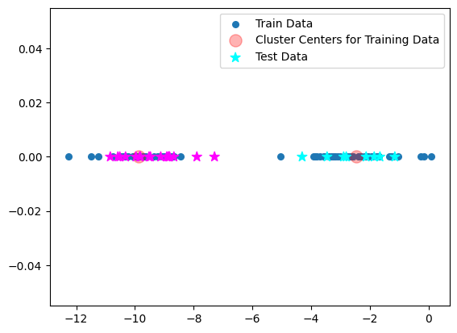

# Description
The K-means Clustering algorithm takes the training data and finds the center point of the clusters made by the data - which is shown as a red circle on the image -. It uses this center point to find the group for the testing data.

# Image

